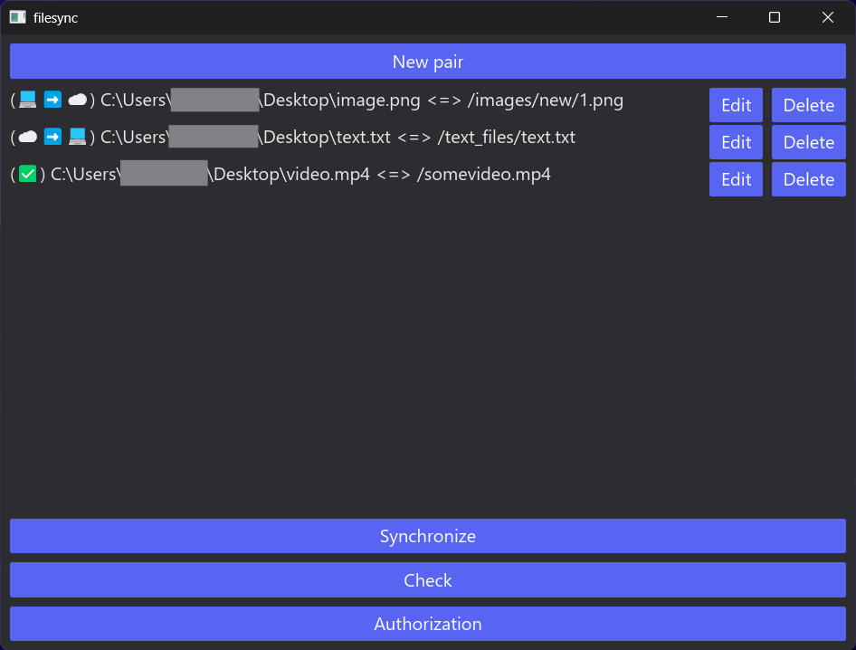

# filesync-rust
Приложение с графическим интерфейсом для синхронизации файлов через облачный диск по протоколу webdav

## Как работает
- Графический интерфейс на iced
- Передача файлов и информации через протокол webdav
- Синхронизация происходит через сравнение последнего времени изменения файлов. Время изменения файла на облачном диске хранится в дополнительном файле с метаданными, без него время изменения берётся из информации о файле
- Данные приложения хранятся с ним в одной директории в базе данных redb

## Технологии
- iced
- webdav
- redb

## Проблемы
- Не заметил